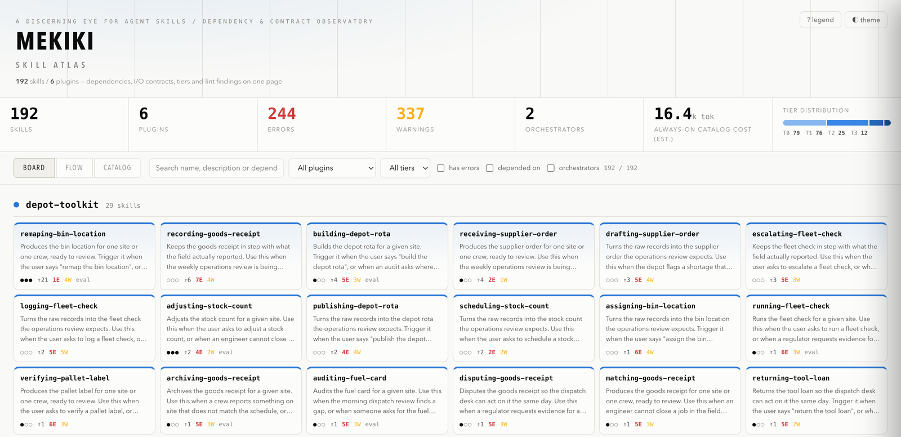
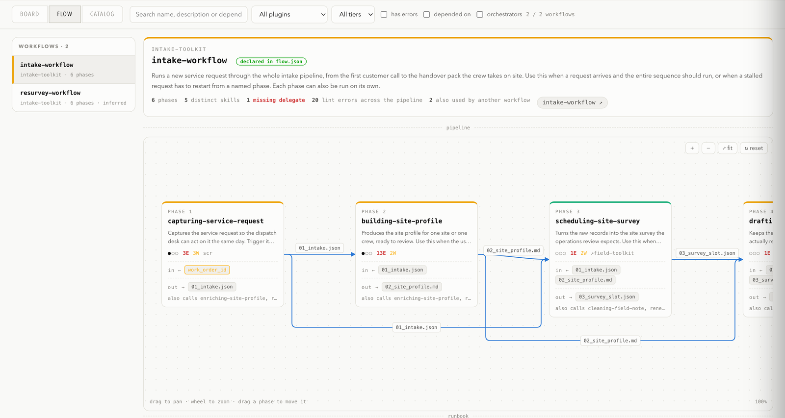
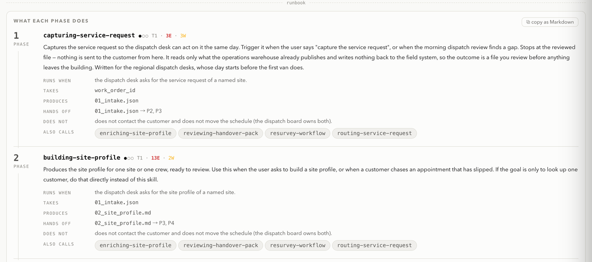
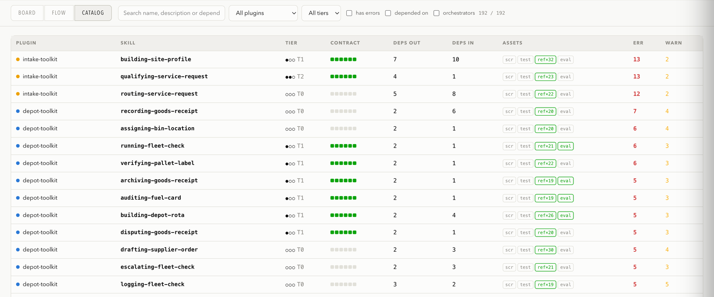

# mekiki

**A discerning eye for your agent skills.**

*mekiki* (目利き) is the Japanese word for the trained eye that judges quality and
authenticity at a glance. This is a single binary that turns that eye on a corpus of Agent
Skills (`SKILL.md`) — the ones your team ships, not the ones you download.

**What it solves:** the Agent Skills spec defines the format of a single skill; mekiki is
the quality gate for the corpus. It mechanically catches what appears once dozens of
team-written skills run together — copied knowledge drifting apart, descriptions that
misfire, guards declared but never invoked, orchestrators delegating to skills nobody
installed — and shows the whole estate on one page.

| Command | What it does |
|---|---|
| `mekiki lint` | Checks a corpus against twenty-five numbered rules — from arithmetic left in prose for a model to execute, to guards that are declared but never invoked, to two skills claiming the same user request. |
| `mekiki atlas` | Renders the whole estate as **one self-contained HTML page**: a board, every workflow as a pipeline you can walk, and a sortable catalogue. |
| `mekiki new` | Scaffolds a skill that is compliant from birth: Contract, Gotchas and both official eval formats, pre-filled. |
| `mekiki diff` | Reports only what a pull request **added** and **resolved**, so review sees the delta and not the backlog. |

Nothing beyond the Go standard library. No configuration needed to start. The inspected
tree is only ever read.

日本語版: **[README.ja.md](README.ja.md)**

## In thirty seconds

```bash
go install github.com/toritori0318/mekiki@latest
mekiki lint path/to/skills
```

```
note: no baseline at baseline.json; treating every skill as pre-existing. Run `mekiki lint <path> --update-baseline` to create one.
error L8   acme-toolkit:publishing-deck     …/publishing-deck/SKILL.md:1     external publication wording ("Publish") is present but Contract Preconditions states no human confirmation step
error L16  acme-toolkit:orchestrating-launch  …/orchestrating-launch/flow.json:1  flow references skill "archiving-run", which does not exist
warn  L18  acme-toolkit:querying-warehouse  …/querying-warehouse/SKILL.md:2  requires: declares "guard-billing" but the body never mentions it (a declaration alone starts no guard — write an imperative invocation step)
warn  L9   acme-toolkit:publishing-deck     …/publishing-deck/scripts:1      scripts/ contains executable code but ships no test

2 errors, 4 warnings (9 skills)
```

Every finding reads *severity · rule · skill · file:line · what is wrong*. Exit code **0**
when there are no errors, **1** when there are; warnings never fail a build.

Then look at the estate as a whole:

```bash
mekiki atlas path/to/skills && open skill-atlas.html
```

## What goes wrong at scale

The [Agent Skills specification](https://agentskills.io) defines the *format* of a skill.
It does not address what happens once an organisation runs dozens or hundreds of them:

- deterministic logic (arithmetic, thresholds, payload transforms) left in prose for a
  probabilistic model to execute
- shared knowledge physically copied between skills, then drifting apart
- activation left to whatever the description happens to say, so skills fire late, or
  never, or all at once
- guards for billable and destructive operations declared but never actually invoked
- an orchestrator delegating to a phase that nobody installed
- no way to prove any of it works

mekiki addresses that layer. Its conventions come from auditing a 165-skill corpus, every
convention maps onto a numbered rule, and a rule only ships after it has been measured
against real skills.

## The Atlas

`mekiki atlas` writes **one HTML file** — no server, no network access, nothing to install
on the reader's side. Attach it to a pull request, or keep it open while you work. It
carries three views of the same corpus, each answering a different question.

*The screenshots below come from a synthetic demo corpus — every skill name and description
in them is invented.*

### Board — what do we actually have?

Named tiles grouped by plugin. Dots are unreadable at corpus scale, names are not. Each
tile carries the maturity tier, lint counts, and whether the skill ships scripts or evals;
workflow skills are marked and link straight into the Flow view. Gauges across the top
include the **always-on catalogue cost**: the tokens every session pays merely to know
these skills exist.



### Flow — what runs in what order, passing what?

Workflow skills only. Each one is drawn as its pipeline on a canvas you can pan, zoom and
rearrange: one card per phase, and edges that follow the **artifacts** — a phase consuming
`01_ctx.json` is joined to whichever phase produced it, not merely to the phase before it.



Below the canvas, a **runbook** reads the same pipeline top to bottom — full description,
the Contract's trigger, what each phase takes and produces, what it hands to which later
phase, and its **Non-goals**, which is usually the answer when you wonder where some step
happens. One button copies the whole thing as Markdown. Beside it, the **artifact ledger**
shows what is produced where and consumed by whom, flagging inputs that no earlier phase
produced. A delegate that is **missing from the corpus** is drawn in red, at the phase
where the pipeline would break.



A workflow appears here as soon as it declares its call order in `flow.json`. Failing
that, mekiki infers one from a `### Phase Registry` table in the body and says so, rather
than claiming knowledge it does not have.

### Catalog — which skills need work?

The sortable table: tier, Contract completeness as six dots, dependencies in and out,
assets, errors, warnings. Sort by `deps in` to find the hubs; sort by `err` to find
tomorrow's work — which is how it opens.



Clicking anything in any view opens the same dossier, with the findings and the transitive
dependency trace.

## In front of a pull request

`mekiki lint --severity error` is the plain gate. On an inherited corpus the useful gate is
the delta: snapshot the base and the head, and fail only on what the change added.

```bash
mekiki lint base/skills --format json > base.json
mekiki lint head/skills --format json > head.json
mekiki diff base.json head.json     # exit 1 only when errors were added
```

Add `--format sarif` to either command and GitHub renders the findings as annotations on
the lines they refer to, rather than as text in a job log. Pass the base snapshot to the
Atlas — `mekiki atlas path/to/skills --base base.json` — and the page marks what the change
added, resolved and introduced, so the delta is read in the context of the whole estate.

A ready-to-paste GitHub Actions job, and how to adopt mekiki without clearing the backlog
first, are in **[docs/USAGE.md](docs/USAGE.md)**.

## Starting a new skill

```bash
mekiki new drafting-weekly-plan --out path/to/skills
```

The skeleton arrives with a Contract, Gotchas and both official eval files — and with a
reminder that creating it may be the wrong move in the first place:

```
Before you fill this in: a new skill is a last resort. If an existing skill's Gotchas or
description, a line in the agent instructions, or a paths/hooks setting would do, delete
this and grow the existing skill instead — the always-on catalog cost scales with the
number of skills.
```

## Driving it from an agent

`skills/auditing-skill-corpus/` is an Agent Skill that teaches a coding agent to run this
audit the way it should be run: settle the baseline before reading a single finding, gate a
change on its delta rather than on the inherited backlog, repair at the layer the rule names
instead of deleting the sentence that tripped it, and **ask** rather than invent a guard
name. Copy it where your agent looks for skills:

```bash
cp -r skills/auditing-skill-corpus ~/.claude/skills/
```

It is held to the conventions it teaches — `mekiki lint skills` reports nothing, it reaches
T3, and a test in this repository keeps it that way.

## The conventions

Four ideas carry the rest, and each maps onto rules mekiki can check:

- **Determinism boundary** — arithmetic, thresholds and transforms belong in `scripts/`
  with tests; prose keeps judgement, synthesis and hypotheses.
- **Contract** — every skill opens with Trigger / Inputs / Preconditions / Outputs /
  Postconditions / **Non-goals**, the entry that prevents scope creep.
- **Context minimality** — a skill body competes for attention with everything else in
  the window, so a new skill is a last resort.
- **Safety in two layers** — a risky skill declares a guard *and* says in the body to
  invoke it, because a declaration alone starts nothing.

Maturity tiers accumulate over those same rules — modelled on SLSA's assurance levels, so a
tier is a measured position rather than an aspiration:

| Tier | Meaning | Condition |
|---|---|---|
| **T0** | exists | the basics carry an error, or the Contract is incomplete |
| **T1** | declared | basics clean **and** all six Contract entries present — the minimum for a new skill |
| **T2** | safe | nothing unsafe left: no arithmetic in prose, guards actually invoked, scripts tested |
| **T3** | verified | both official eval formats present — output quality and trigger accuracy — and, where a run was recorded, it passed |

Nothing applicable counts as satisfied — a knowledge skill with nothing to guard reaches
T2, because having nothing to guard is a safe state. The Atlas carries this same legend
behind its **? legend** button.

## Documentation

| Document | What it covers |
|---|---|
| **[SKILL_PROTOCOL.md](SKILL_PROTOCOL.md)** ([日本語](SKILL_PROTOCOL.ja.md)) | The conventions in full — what skill authors read. |
| **[docs/USAGE.md](docs/USAGE.md)** ([日本語](docs/USAGE.ja.md)) | Every command, CI recipes, baselines, configuration, suppression. |
| **[docs/DESIGN.md](docs/DESIGN.md)** ([日本語](docs/DESIGN.ja.md)) | Precise rule definitions and the data model. |
| **[docs/DECISIONS.md](docs/DECISIONS.md)** ([日本語](docs/DECISIONS.ja.md)) | What was adopted, what was rejected, and why. |

## Development

```bash
go test ./...
gofmt -l . && go vet ./...
```

A rule ships only after it has been measured against a real corpus: a warning that fires on
most skills gets ignored, and a rule that fires on nothing is pure cost. Both have happened
here, and both are recorded in [docs/DECISIONS.md](docs/DECISIONS.md); the workflow for
changing a rule is [§9.3 of docs/DESIGN.md](docs/DESIGN.md#93-method). The screenshots
above are regenerated from a fictional demo corpus, never from a real one —
[scripts/README.md](scripts/README.md) has the commands.

## License

[MIT](LICENSE)
